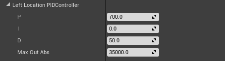

UPIDController
=====

Plugin with a PID controller USTRUCT (`FPIDController`), and a PID controller for `FVector`'s in 3 dimensional space (`FPIDController3D`.

Usage
=====

-   Add the plugin to your project (e.g `MyProject/Plugins/UPIDController`)  
    

-   Add the module dependency to your module (Project, Plugin); In the
    `MyModule.Build.cs` file:  

		PublicDependencyModuleNames.AddRange(  
		new string[]  
		{  
		...  
		"UPIDController",  
		...  
		}  
		);  
    

-   Include `PIDController.h` or `PIDController3D.h` where you plan to use the controller.


- Declare your PID Controller

```cpp

	/* Control */
	// Left/Right hand location PID controller
	UPROPERTY(EditAnywhere, Category = "Physics Based Motion Controller|Control")
	FPIDController3D LeftLocationPIDController;

```


- Add the PID values



```cpp

	/* Control parameters */
	// Location PID default parameters
	LeftLocationPIDController.P = 700.0f;
	LeftLocationPIDController.I= 0.0f;
	LeftLocationPIDController.D = 50.0f;
	LeftLocationPIDController.MaxOutAbs = 35000.f;
	
	// Init PID -- update function will be optimized if I and/or D are 0
	LeftLocationPIDController.Init();

```


- Update PID to get the output values:


```cpp
	// InDeltaTime type float
	// const FVector LeftCurrError = MCLeft->GetComponentLocation() - LeftSkeletalMeshComponent->GetComponentLocation();
	const FVector LeftLocOutput = LeftLocationPIDController.Update(LeftCurrError, InDeltaTime);
```


### Engine Version 4.18
